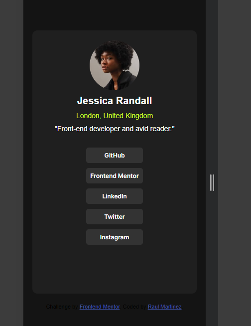

# Frontend Mentor - Social links profile solution

This is a solution to the [Social links profile challenge on Frontend Mentor](https://www.frontendmentor.io/challenges/social-links-profile-UG32l9m6dQ). Frontend Mentor challenges help you improve your coding skills by building realistic projects. 

## Table of contents

- [Overview](#overview)
  - [The challenge](#the-challenge)
  - [Screenshot](#screenshot)
  - [Links](#links)
- [My process](#my-process)
  - [Built with](#built-with)
  - [What I learned](#what-i-learned)
  - [Continued development](#continued-development)
  - [Useful resources](#useful-resources)
- [Author](#author)
- [Acknowledgments](#acknowledgments)

## Overview

### The challenge

Users should be able to:

- See hover and focus states for all interactive elements on the page

### Screenshot

Add a screenshot of your solution. The easiest way to do this is to use Firefox to view your project, right-click the page and select "Take a Screenshot". You can choose either a full-height screenshot or a cropped one based on how long the page is. If it's very long, it might be best to crop it.

Alternatively, you can use a tool like [FireShot](https://getfireshot.com/) to take the screenshot. FireShot has a free option, so you don't need to purchase it. 

Then crop/optimize/edit your image however you like, add it to your project, and update the file path in the image above.

**Note: Delete this note and the paragraphs above when you add your screenshot. If you prefer not to add a screenshot, feel free to remove this entire section.**

### Links

- Solution URL: [ChatGPT](https://chatgpt.com/)
- Live Site URL: [Add live site URL here](https://your-live-site-url.com)

## My process

I was on the discord and I was view some of the finsihed prjects and I came across this one and thought it would be a good idea to create the project. 

### Built with

- Semantic HTML5 markup
- CSS custom properties
- Font Link
- Mobile-first workflow

### What I learned

I learned a lot. I been studying HTML and CSS for a while now but I wanted to create a project without looking at my notes and tutorial videos. I wanted to do the project all on my own, I did how ever used ChatGPT. I coded 60 percent of a rough project and chatgpt helped me complete it. the project took me four days one hour a day. the last day I worked on the markdown readme. Thank you.

### Continued development

some of the things I want to continue to develope is being able to look at a desgin and code 90% of the project without tutorials. I do use my notes and I do use ChatGPT. I also want to get better at JavaScript. Thank you. 

### Useful resources

- [ChatGPT](https://chatgpt.com/) - The only resources I used was chatgpt. I coded 60% of a rough project and I asked it to polish it and correct some of the mistakes. It did do a good job. 
- [Google Fonts](https://fonts.google.com/specimen/Inter) - This is what I used to change the font of the project. you can find it in the `style-guide.md`

## Author

- Website - [Raul Martinez](https://semi26.github.io/)
- Frontend Mentor - [Buddyyy @semi26](https://www.frontendmentor.io/profile/semi26)

## Acknowledgments

I was on Discord, under the finsihed projects I saw the Social Links Profile I dont remember whose code I was looking at the time but I thought this was a easy project to complete. I did not copy code for code, but I did use it to get the idea down. I can not remember the use name but it was a fellow front-end mentor peer. Thank you 